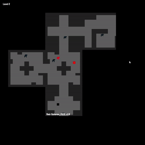

# Roguelike

A procedural generation game written on Python 3.10 with pygame. The player can move around using the arrow keys and should reach the red square until it becomes too dark. Avoid the enemies!

## Running

Do `pip install -r requirements.txt` and run `main.py` to start the game or run `python cx_setup.py build` from the `src` folder to build the .exe file (will appear in the `src/build` folder by default).

## Troubleshooting

Do `conda install -c conda-forge libstdcxx-ng` to mitigate `libGL error: MESA-LOADER: failed to open swrast: /usr/lib/dri/swrast_dri.so: cannot open shared object file: No such file or directory (search paths /usr/lib/x86_64-linux-gnu/dri:\$${ORIGIN}/dri:/usr/lib/dri, suffix _dri)`. See [1](https://stackoverflow.com/questions/54063285/numpy-is-already-installed-with-anaconda-but-i-get-an-importerror-dll-load-fail) and [2](https://stackoverflow.com/questions/57567892/intel-mkl-fatal-error-cannot-load-mkl-intel-thread-dll).